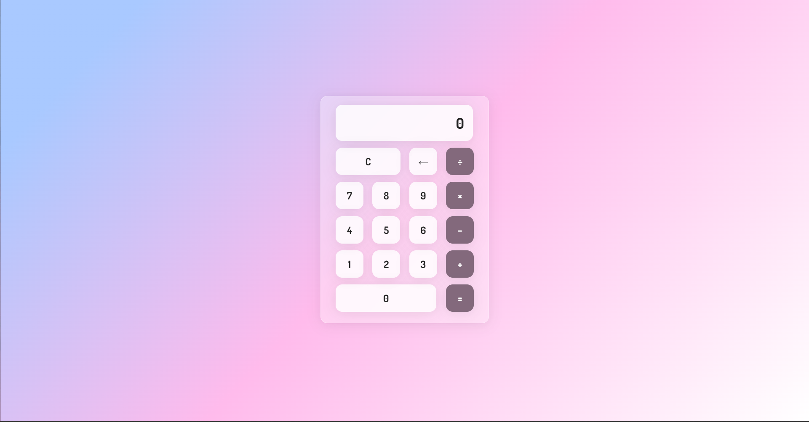

### Screenshot



### Links

- Live Site URL: [Add solution URL here](https://calculatorappbilska.netlify.app/)


### Built with

- HTML5
- CSS
- JavaScript
- Mobile-first workflow


### What I learned


```css
backdrop-filter: blur(5.5px);
    -webkit-backdrop-filter: blur(5.5px);
.double{
    flex-basis: 47%;
}
```

### Useful resources

- [CSS Overflow Property Explained](https://www.youtube.com/watch?v=Z7TkyiC8wNA)
- [parseInt function](https://www.youtube.com/watch?v=VzRpyRVbLpE&t=56s) 

## Author

- Based on [AsmrProg](https://www.youtube.com/watch?v=sBJmRD7kNTk&t)

